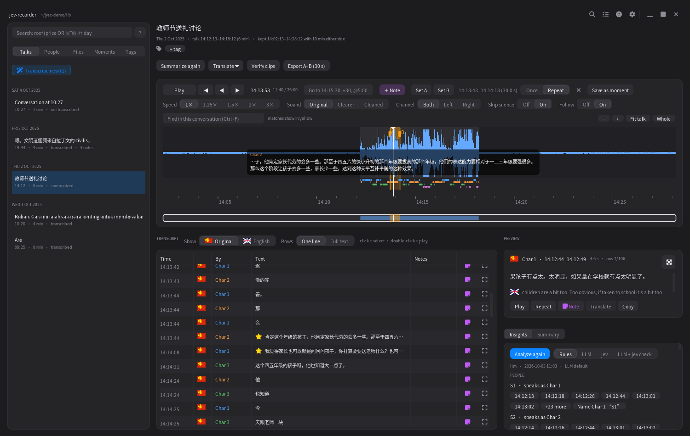
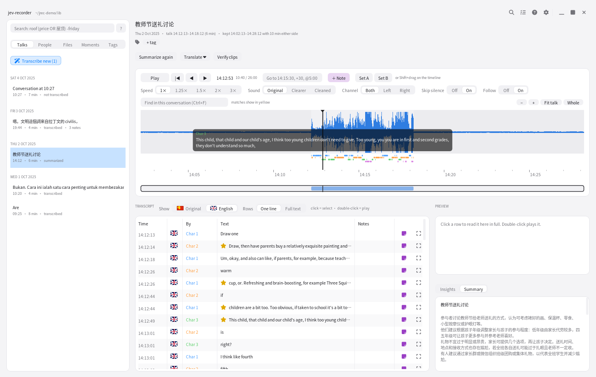
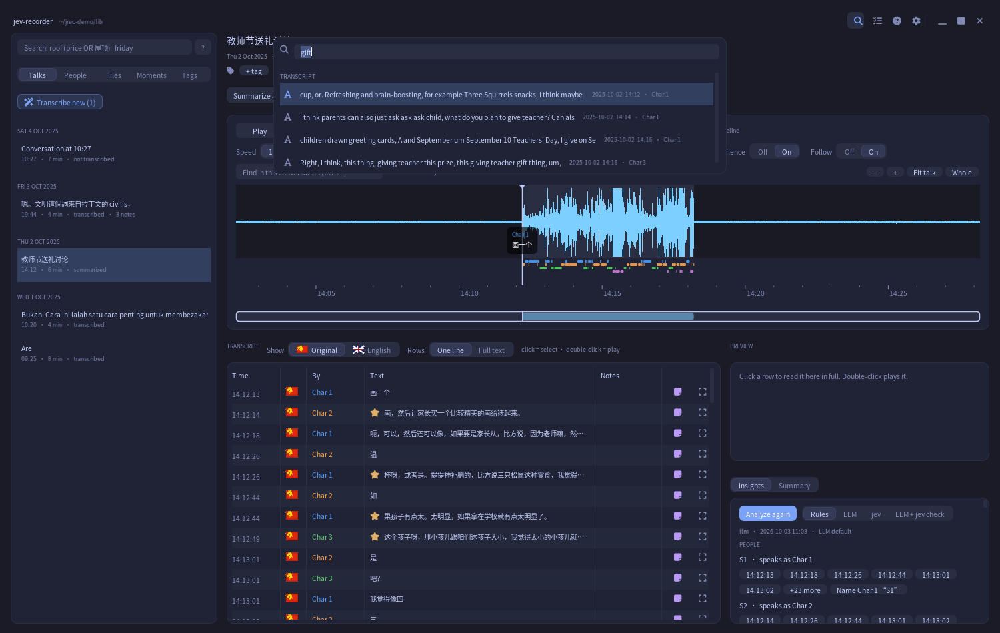
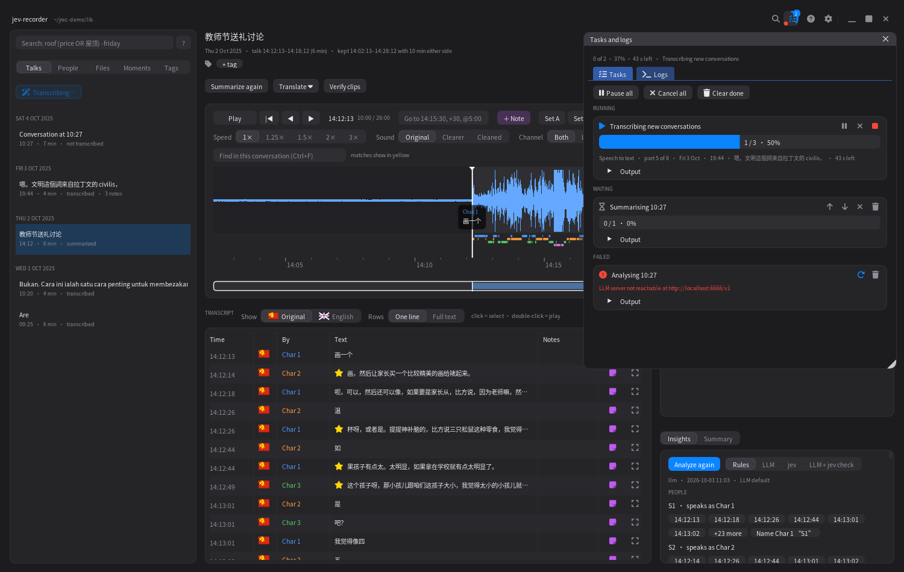
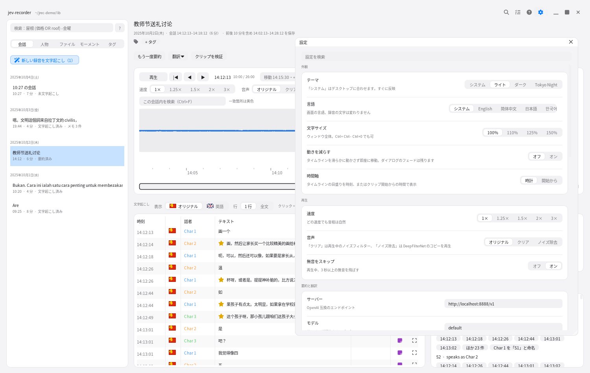
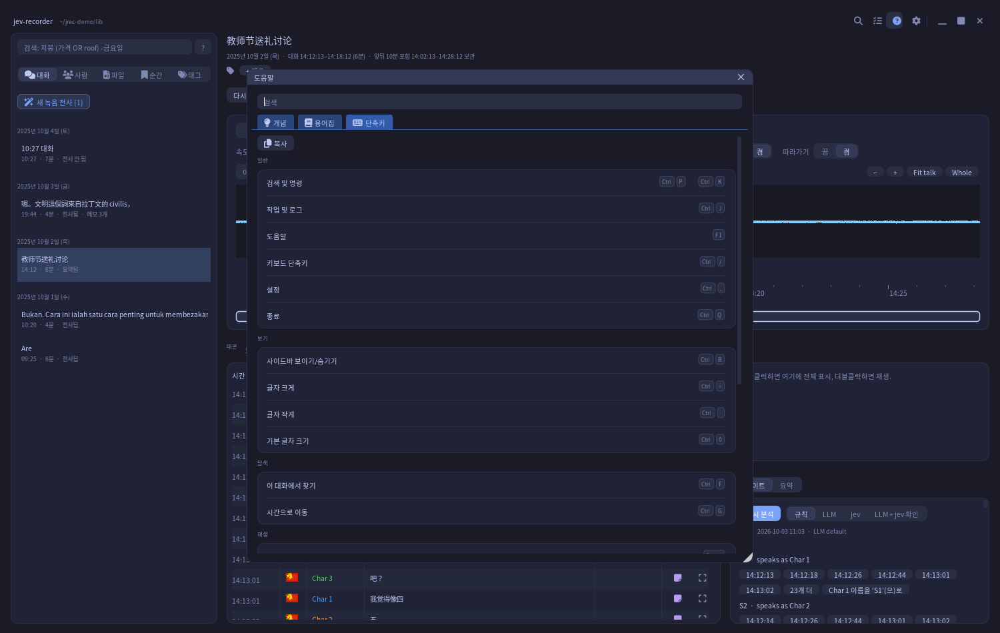
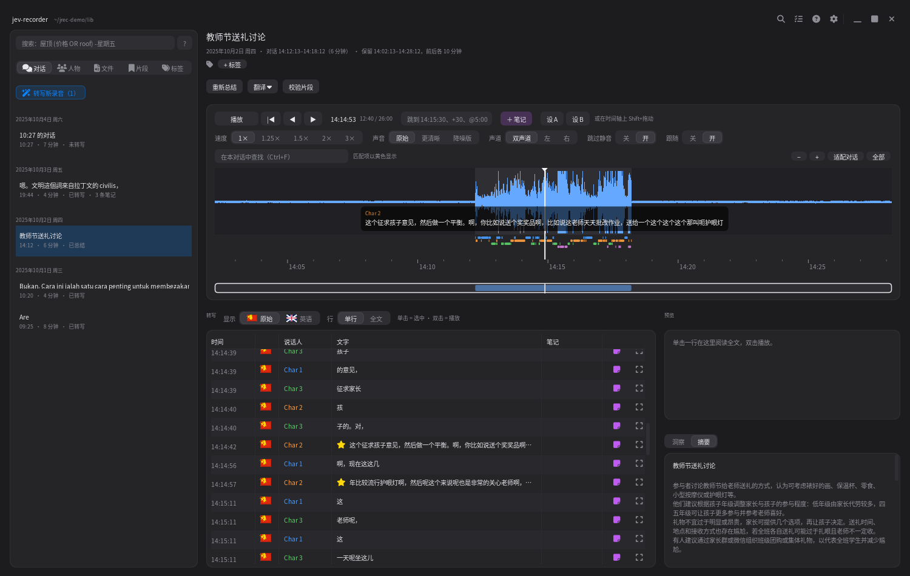

# jev-recorder

Plug in a USB voice recorder (Sony ICD-TX660 profile built in): recordings are archived
untouched, conversations are cut with 10 min of raw audio kept on each side, transcribed
offline (Qwen3-ASR-1.7B or Cohere Transcribe, word times, speakers) on a real wall-clock timeline, summarised by
any OpenAI-compatible LLM, and searchable. Every clip is an exact byte range of the archived
original, with a shell command in `manifest.json` to verify it.

```bash
uv venv -p 3.12 && uv pip install -e ".[spike,ui,dev]"   # ML deps live in the spike extra for now
scripts/fix-imgui-gl.sh                                   # once, after installing imgui-bundle
jrec ui                                                   # desktop app (import dialog pops up on plug-in)
jrec watch                                                # or: notification-only daemon
jrec import /media/$USER/IC\ RECORDER                    # or step by step: import, cut, transcribe,
jrec process                                              #   enhance, summarize (process = all of them)
jrec search 预算                                           # full-text search (CJK works)
jrec verify                                               # re-check every clip against the archive
```

Config: `config.toml` in `~/.config/jrec` (Linux), `%APPDATA%\jrec` (Windows) or
`~/Library/Application Support/jrec` (macOS); defaults in `src/jrec/config.py`: library path, device
profiles, and `[llm.profiles.*]` endpoints. UI preferences sit next to it in `ui.json`; the launch log is in
`~/.cache/jrec` / `%LOCALAPPDATA%\jrec`. Plan and decisions: [PLAN.md](PLAN.md).
Diarization runs in `.venv-nemo` (Transformers >= 5); see `src/jrec/diarize.py`.

## Speech model (Settings > Transcription, or `[asr]` in the config)

| | Qwen3-ASR-1.7B (default) | [Cohere Transcribe 03-2026](https://huggingface.co/CohereLabs/cohere-transcribe-03-2026) |
|---|---|---|
| Languages | 52, finds the language itself | 14 (ar de el en es fr it ja ko nl pl pt vi zh), language must be given |
| Runs in | `.venv` | `.venv-nemo` worker (Transformers >= 5.4) |
| Word times | Qwen3-ForcedAligner / MMS | the same aligners |

- `language = "auto"` (Cohere only): Qwen3-ASR finds each chunk's language, Cohere writes the text.
  Chunks in other languages (Malay, Tamil, ...) keep the Qwen3-ASR text.
- `language = "en"` (or another ISO code): Cohere only; Qwen3-ASR is not loaded.
- The Cohere model is gated: accept its terms on Hugging Face, then `hf auth login`.
- One run only: `jrec transcribe --asr cohere FOLDER`. `transcript.json` records the model in `asr`.

## Gallery

Real audio, real model output. The demo meeting is a 4-person Mandarin table-microphone meeting from
[AliMeeting](https://www.openslr.org/119/) (CC BY-SA 4.0), transcribed by Qwen3-ASR-1.7B. The summary, the
Insights and the English translation come from a local LLM (Qwen3.8 Flash Next on TensorFold).

| | |
|---|---|
|  |  |
| **Dark.** Timeline with a subtitle under the playhead, an orange A–B range, the transcript, the preview and LLM Insights. | **Light.** The same meeting shown in English (LLM translation), with its LLM summary. |
|  |  |
| **Tokyo Night.** Ctrl+P: "gift" finds lines of the Mandarin meeting through their English translation. | **Tasks and logs** (Ctrl+J): progress, time left, Pause / Stop / Cancel / Retry. |
|  |  |
| **日本語.** Settings: one setting per row, changes save at once. | **한국어.** Help › Shortcuts, generated from the command list. |
|  | |
| **简体中文.** Dates, labels and Help follow the interface language; recordings are never changed. | |

### Demo library

`scripts/make_demo.py` builds `~/jrec-demo` from public audio in `spike/data` (fetch it with `spike/fetch_data.sh`):

| Recording | Source | Content |
|---|---|---|
| 2025-10-01 09:00, 120 min | [AMI](https://groups.inf.ed.ac.uk/ami/corpus/) (CC BY 4.0) + [FLEURS](https://huggingface.co/datasets/google/fleurs) Malay | English meeting, then a quieter Malay talk |
| 2025-10-02 14:00 | [AliMeeting](https://www.openslr.org/119/) R8003 (CC BY-SA 4.0) | 6 min of a 4-person Mandarin meeting |
| 2025-10-03 19:30 | [FLEURS](https://huggingface.co/datasets/google/fleurs) Cantonese (CC BY 4.0) | 4 min of read Cantonese |
| 2025-10-04 10:15 | [ASCEND](https://huggingface.co/datasets/CAiRE/ASCEND) session 2 (CC BY-SA 4.0) | 7 min of a real, unscripted Hong Kong chat that switches between Mandarin and English |

Each recording sits between 12 and 22 minutes of room tone, like a real recorder file, so the app has to find the
conversation and keep 10 minutes of raw audio on each side. ASCEND sessions are rebuilt with their real timing
(each utterance's start is in its file name), and `ses<N>.json` keeps the reference transcript for comparison.

## The desktop app

- **Top bar** (no system title bar): drag it to move the window, double-click to maximise. Top right, always in
  this order: **Search** (Ctrl+P), **Tasks and logs** (Ctrl+J), **Help** (F1), **Settings** (Ctrl+,), then
  minimise, maximise and close.
- **Search** opens one palette for everything: commands (with their shortcuts), settings, help topics,
  conversations and transcript lines. ↑ ↓ move, Tab jumps to the next group, Enter runs, Esc closes. An empty
  search shows your recent commands.
- **Task queue.** Transcribe, summarize, translate, analyze and the cleaned copy all go into one queue and run
  one at a time (GPU and heat rule). The Tasks icon shows a progress ring and a count badge. The panel lists
  each task with its progress, current step and time left:
  - **Pause** and **Resume** (only for "Transcribe new"): finished conversations are kept.
  - **Stop**: ends the job; finished conversations are kept and the current one stays as it was.
  - **Cancel**, **Retry**, **Remove**, and move a waiting task up or down.
  - **Logs** tab with Error / Warning / Info filters, search, Copy, and Open log folder.

  The queue is saved in the library (`tasks.json`). After a restart, an interrupted "Transcribe new" comes back
  paused; other interrupted jobs come back failed, ready to retry.
- **Help** (F1) has three tabs: Concepts, Glossary, and Shortcuts. The Shortcuts tab is generated from the same
  command list the palette uses.
- **Timeline:**
  - The waveform shows the conversation with its 10 min of raw padding (shaded), the speaker lanes, notes and
    search matches.
  - **Subtitles:** the line being spoken shows as a caption under the playhead, with the speaker's name in their
    colour. When the transcript shows a translation, the caption shows it too. Right-click the timeline and
    choose **Show subtitles** to turn them on or off.
  - **A–B range** (Shift+drag, or [ and ]) shows in see-through orange on the timeline and the minimap.
    Drag its edges or its top strip to change it. Repeat it, save it as a moment, or export it byte-exact.
- **Themes:** System (follows the desktop), Light, Dark and Tokyo Night. Change it in Settings, or type "theme" in
  the search palette. There is no shortcut, because Ctrl+Shift+T means "reopen tab" in most apps.
- **Languages:** English, 简体中文, 日本語 and 한국어. A switch applies at once, CJK glyphs included. Text from
  recordings is never translated by this setting.
- Text is drawn oversampled and anti-aliased; Ctrl+= / Ctrl+- / Ctrl+0 change the text size.
- **Dialogs** move by dragging any empty spot, remember where you left them, and stay inside the window.
  Double-click an empty spot to centre a dialog again. Every border between panes drags, and a double-click
  resets it. Ctrl+B hides the sidebar.
- **Window:** drag the top bar to move it, double-click it to maximise, right-click it for Minimize, Maximize
  and Close. Drag any edge or corner to resize. The size, position and maximised state come back on the next start.
- **One window per library:** a second `jrec ui` for the same library brings the open window to the front.
  The demo library and your real library can be open at the same time.
- **Help menu** (the ? icon): Help (F1), Keyboard shortcuts (Ctrl+/), About. A one-time tip under the search
  icon says "Press Ctrl+P to find anything".
- **Status line** (Tasks and logs): "Ready · LLM server online", or the running task with its percentage, time
  left and why it waits ("Cooling down", "Waiting for GPU"). An OS notification appears when a task longer than
  30 s finishes while the window is in the background.
- **Settings › Advanced:** buttons open the config folder, the log folder and the library folder.
- **Accessibility:** Settings › Accessibility › Keyboard focus lets Tab and the arrow keys move between controls.
  It is off by default because the arrows and Space control the player. Screen readers cannot read the app,
  because Dear ImGui has no accessibility tree; everything works from the keyboard.
- **Launch log:** `~/.cache/jrec/ui.log` (`%LOCALAPPDATA%\jrec\ui.log` on Windows) records each start, any crash,
  and why the window closed: the title-bar close button, a quit request, or the desktop (window manager,
  Alt+F4, logout). It rotates at 1 MB. `jrec --version` prints the version.

| Keys | Action |
|---|---|
| Ctrl+P / Ctrl+K | Search and commands |
| Ctrl+J | Tasks and logs |
| F1 / Ctrl+/ | Help / Keyboard shortcuts |
| Ctrl+, | Settings |
| Ctrl+B | Show or hide the sidebar |
| Ctrl+F / Ctrl+G | Find in this conversation / Go to a time |
| Space, N, P | Play/pause, next/previous speech |
| [ ] L | Set A, set B, repeat A–B |
| M | Add a note here |
| ← → (Shift 1 s, Alt 30 s) | Back/forward 5 s |
| Ctrl+Q | Quit |

Platforms: Linux x86_64 and arm64 (GB10) and Windows x64. CI runs the core tests on all three. GPU
transcription needs CUDA; the rest (archive, cutting, search, notes, the UI) runs anywhere.

## Search syntax (sidebar search and "Find in this conversation")

```
roof price                    both words, any order (case, width and 繁/简 ignored)
roof OR 屋顶   roof | 屋顶       either
roof (price OR cost) -cheap   grouping and exclusion (NOT works too)
"next friday"                 exact phrase
/\d{4}\s?\d{4}/                regular expression
note:roof tag:家庭 by:mum lang:cantonese
time:14:00-15:30 date:2025-10-03 after:2025-10-01 before:2025-10-05
```
Rows are matched on their text, translations, notes, speaker name and the talk's/recording's tags.
